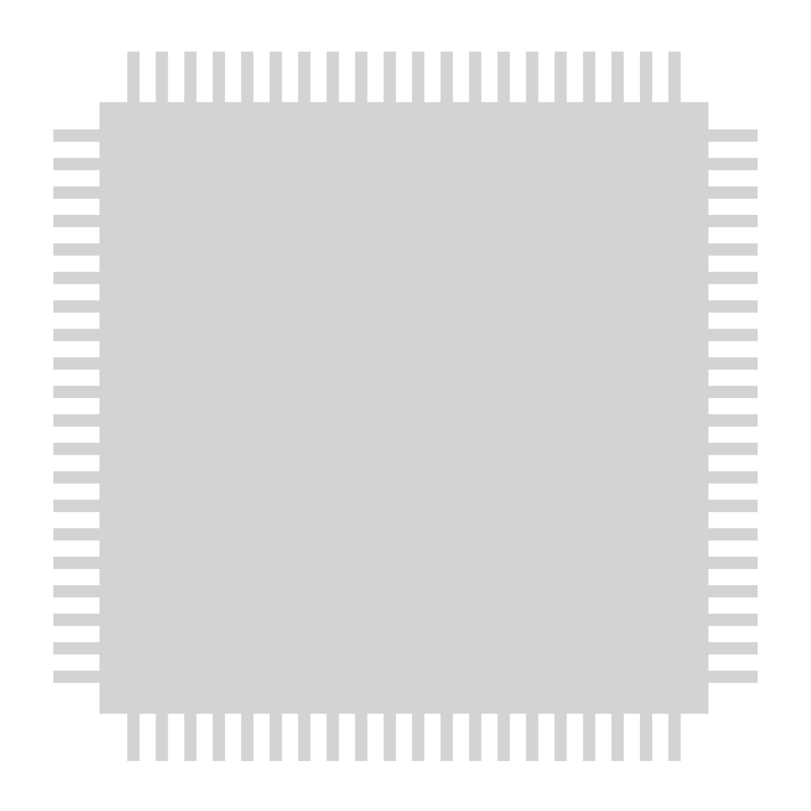

  

<h1 align="center">M68k Reference Project</h1>

  

Website of the [M68k Reference Project](https://m68k.dev), a centralized repository of documentation relating to the Motorola 680x0 family of microprocessors.

## Roadmap

Coming soon.

## Contributing

If you would like to contribute to the project, [fork the repository](https://github.com/markjamesm/m68k-reference/fork) and submit a pull request containing your changes. Please ensure that your pull request clearly outlines what was changed, and make sure to cite any related sources.

This website was built using the [Starlight](https://starlight.astro.build/) documentation platform, and you can consult the [documentation here](https://starlight.astro.build/getting-started/) on how to use it.